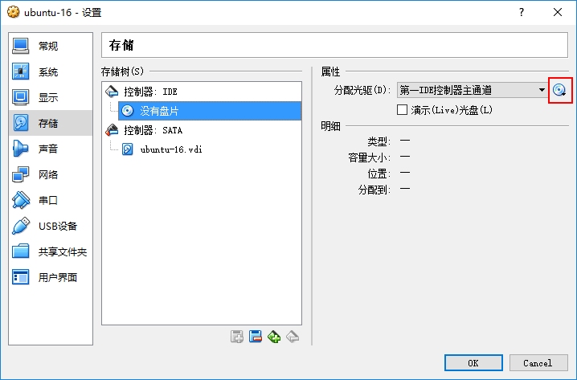

# VirtualBox XP

Host: Windows 10; Guest: XP

## 创建 XP 虚拟机

准备 XP ISO

- 是安装盘 ISO 而不是 ghost ISO。
- 主机 CPU 不支持虚拟化的话，虚拟机只能使用 32 位。可以用 SecurAble 检测。

### 新建虚拟机

打开菜单“管理 -> 全局设置..."，将“默认虚拟电脑位置”改到非系统盘上。

点击主界面“新建”按钮，按新建向导进行即可。虚拟硬盘大小 10G 左右。

进入 “存储” 配置：

- 点击主界面“设置”按钮，选择“存储”页面
- 点击主界面右面板中的 “存储”

点击光盘图标加载 XP ISO

点击主界面“启动”按钮，启动虚拟电脑。

### 安装 XP

虽然是虚拟电脑，将磁盘划分一下（比如两个），把自己的文件与系统分开。

安装完成后，进入 XP。

如果没有网络，退出 XP，进入“网络”配置，将控制芯片换一下，再启动 XP，看看是否正常。

### 安装增强功能

增强功能提供共享文件夹，自动调整窗口大小，双向复制等功能。

主界面点击菜单“管理 -> 热键 -> 虚拟电脑" 查看“主机组合键” Host 键，默认为 Right Ctrl。

启动虚拟机, `Host + Home` 打开菜单栏，选择“设备 -> 安装增强功能”，会自动打开增强功能安装界面。
如果不能，则进入已挂载的增强功能光盘（VBoxGuestAdditions.iso），双击 VBoxWindowsAdditions-x86.exe 运行。

安装增强功能后会要求重启。更新 Virtualbox 后，增强功能也需要更新。

此时可以考虑对虚拟机做个快照。
