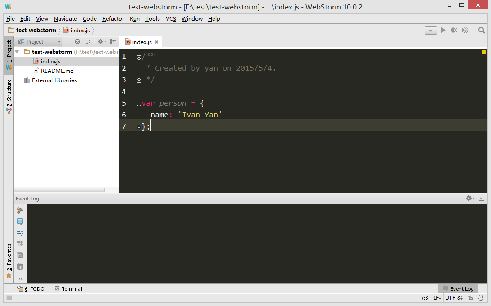
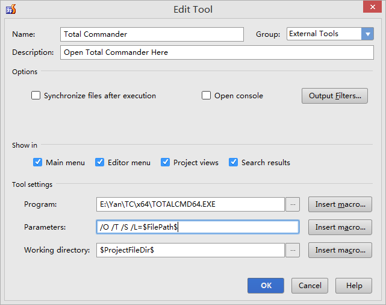
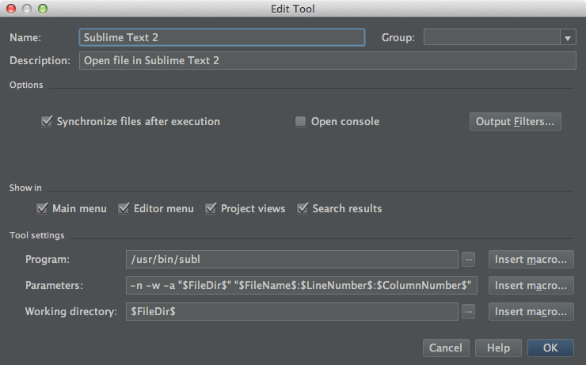

# WebStorm

[JetBrains](https://www.jetbrains.com/) 提供了一系列程序语言的 IDE，它们都是基于同一个架构，根据不同的语言定制:

- [WebStorm](https://www.jetbrains.com/webstorm) 支持 JavaScript，Node.js，不支持 PHP。
- [PhpStorm](https://www.jetbrains.com/phpstorm/) 支持 PHP，也支持 JavaScript，对 Node.js 支持比较欠缺。

这些 IDE 都是以项目为编辑对象，即先创建项目，再编辑项目里面的文件。不能直接打开单个文件编辑，这时应该用 [Sublime Text](../sublimetext/index.md) 等轻量组级编辑器。

问题或建议在官方 [issues](https://youtrack.jetbrains.com/issues) 提交。

下面的说明均以 WebStorm/Windows 为例。

## 界面

[文档](https://www.jetbrains.com/webstorm/help/webstorm-editor-guided-tour.html)

## 配置

菜单 `Files | Settings`。不知道下面配置项的具体位置，可以用搜索。不过，它的搜索比较糟糕。

### 语法高亮

`Editor > Colors & Fonts`，选择 Scheme。

我一直用 Monokai。不过对于 Markdown 支持得不大好。

[Solarized](https://github.com/jkaving/intellij-colors-solarized)

[主题网站](http://www.ideacolorthemes.org/home/)

### 行号

显示行号 `Editor > General > Appearance`， 勾选 show line numbers。

编辑区跳转到某行，快捷键 Ctrl + G。

### 字体

默认字体太小了。

`Editor > Colors & Fonts > Font` 改为 18px/1.2 Consolas。

`Editor > General` 勾选 "Change font size(Zoom) with Ctrl+Mouse Wheel"，特别是消息窗格，用这个办法调整字体大小。对编辑区调整大小，不能保存，只能用上面的办法设置。

### 编码

`Editor > File Encodings`, IDE 与 Project 都改为 UTF8。

编辑区底部点击当前编码，比如 UTF8，可以改变当前文件的编码。

导航树选择目录或文件，点击菜单 `File | File Encoding`，可以改变选中目标的编码。

### 换行符

`Editor > Code Style`, 选择 line separator(for new files)，将新建文件的换行符改为 Unix and OS X(\n)。

编辑区底部点击换行符，比如 LF，可以改变当前文件的换行符。

导航树选择目录或文件，点击菜单 `File | Line Separators`，可以改变选中目标的换行符。

### 文件类型

`Editor > File Types` 指定文件类型对应的扩展名。

在这里也可以忽略某些目录或文件，比如忽略 sublime 项目文件：`*.sublime-project;*.sublime-workspace;`。当然通常是不会混着用的。

### 拼写检查

关掉拼写检查 spelling

### 外部工具

`Settings > Tools > External Tools` 添加外部工具，之后在快捷菜单 External Tools 菜单项下启动外部工具。

添加 Total Commander:

添加 Sublime Text，[Is there a way to connect Intellij IDEA to Sublime Text on Mac OS X?](http://stackoverflow.com/questions/16130586/)

## 特色功能

本地历史

## 导航

光标移到编辑区的标签栏上，会显示文件的路径。

按住 Ctrl, 点击编辑区的标签栏，会显示一个下拉列表，可以沿路径向上导航。

打开项目内文件，菜单 `Navigate -> File...`

## 技巧

快捷键 `Ctrl + Shift + A`，会打开跟 Sublime Text 那样的命令面板，直接输入命令，不用在菜单里面翻找了。

在路径字符串上用快捷键 `Ctrl + B`

会提示安装插件，比如 Markdown。

错误导航，错误透镜
