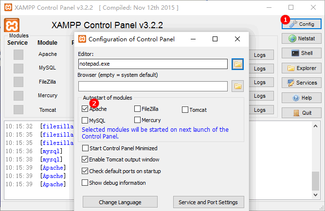

# XAMPP 安装与卸载

## 安装

[下载](https://www.apachefriends.org/download.html)

不要安装到像 c:\Program Files 这样需要 UAC 权限的目录中。
安装路径不要包含中文，空格。

安装最后选择打开 XAMPP Control Panel，在这里管理 apache、mysql 等服务。

点击 Apache 启动按钮，在浏览器中输入 <http://localhost>，访问本地服务器。
本地服务器的文件位于安装目录下面 htdocs 目录。
如果没有改动，上面地址将自动转至 <http://localhost/dashboard>。
建议浏览一遍 FAQ 和 HOWTO。

打开 phpMyAdmin 时先在 XAMPP Control Panel 启动 MySQL。

配置 XAMPP Control Panel，让 Apache、MySQL 等随 Panel 自动启动

点击 Service 勾选框可以将 Apache 等注册为系统服务。
不过不推荐，因为可能导致冲突。

## 卸载

打开 XAMPP Control Panel，停掉所有服务。

备份 apache、php、mysql 等配置，以及数据库，htdocs。

系统控制面板卸载。

